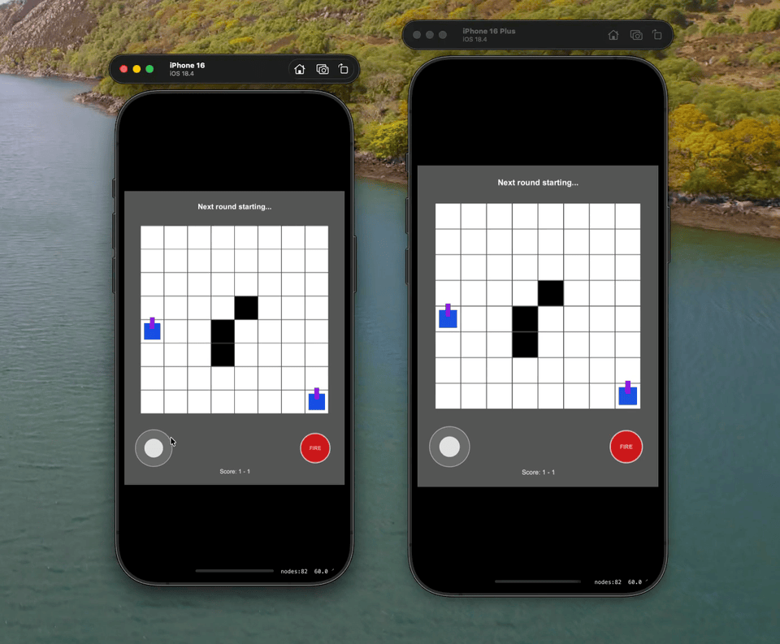

# Tank Game 🎮

A multiplayer iOS tank game with both local and internet play, built with VS Code agent mode 🚀

## Features

- **Local Multiplayer**: Play with friends on the same network using Bluetooth/MultipeerConnectivity
- **Internet Multiplayer**: Connect with friends over the internet using WebSocket server
- Simple joystick controls and firing mechanics
- Rainbow tank animations
- Round-based scoring system

## How to Play

1. Launch the app on your iOS device or simulator
2. Choose your multiplayer mode:
   - **Host Game**: Host a local network game
   - **Join Game**: Join a nearby local network game
   - **Connect to Internet Lobby**: Connect to an internet game using a passphrase
3. Move your tank with the joystick (left side)
4. Tap the FIRE button (right side) to shoot
5. Destroy your opponent's tank to win the round!

## Internet Multiplayer

The internet multiplayer feature uses a simple WebSocket server that manages lobbies based on passphrases.

### Setting up the Server

1. Navigate to the `server` directory
2. Install dependencies:
   ```bash
   pip install -r requirements.txt
   ```
3. Run the server:
   ```bash
   python server.py
   ```
4. The server will start on port 8765

### Connecting to a Lobby

1. In the app, tap "Connect to Internet Lobby"
2. Enter a passphrase in the format `verb-noun` (e.g., `jump-rocket`)
3. Share the passphrase with your friend
4. When both players connect with the same passphrase, the game starts!

For more details, see [server/README.md](server/README.md).

## Development

See how copilot and I built it on the VS Code livestream:
- [Part 1](https://www.youtube.com/live/EXURiXZ-8YU?si=CxOHRCNSuBTQnlv0&t=7740)
- [Part 2](https://www.youtube.com/live/IdPtTBbYOtw?si=GZP3EgKK21EYIz--)

