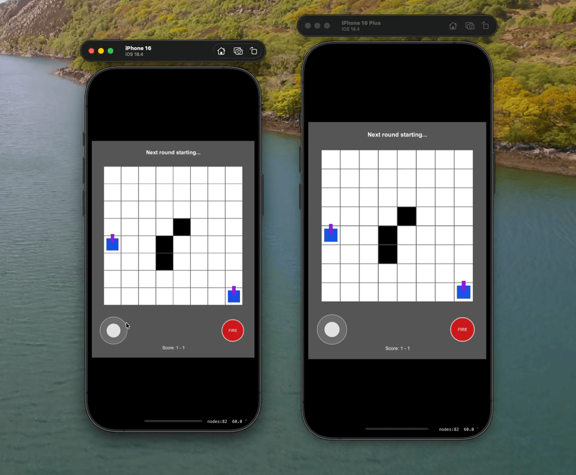

A multiplayer ([bluetooth](https://developer.apple.com/documentation/multipeerconnectivity)) iOS tank game, built entirely with VS Code agent mode 🚀  Built to kill time in long car rides with your siblings.

See how copilot and I built it on the VS Code livestream. ([1](https://www.youtube.com/live/EXURiXZ-8YU?si=CxOHRCNSuBTQnlv0&t=7740), [2](https://www.youtube.com/live/IdPtTBbYOtw?si=GZP3EgKK21EYIz--))

## Features

- 🎮 Multiplayer gameplay via Bluetooth (MultipeerConnectivity)
- 💥 Crash reporting with automatic GitHub issue creation (see [CRASH_REPORTING.md](CRASH_REPORTING.md))
- 🎨 Modern visual styling
- 🔊 Sound effects

## Testing

For information about testing the game, including how to run two simulators for multiplayer testing, see [TESTING.md](TESTING.md).

