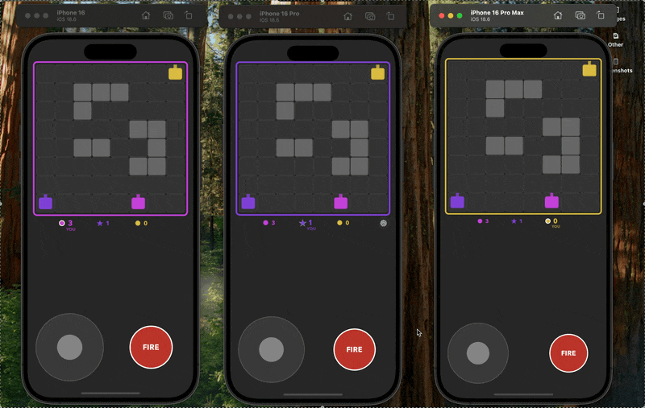
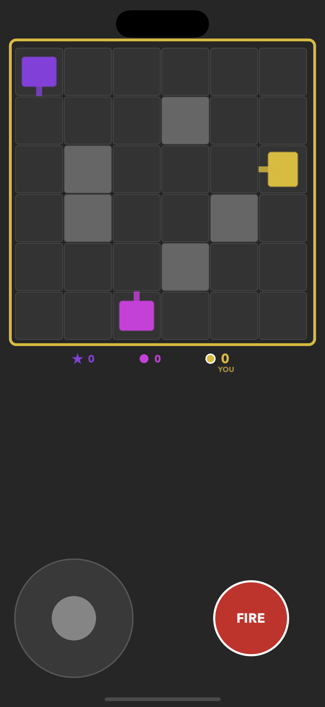
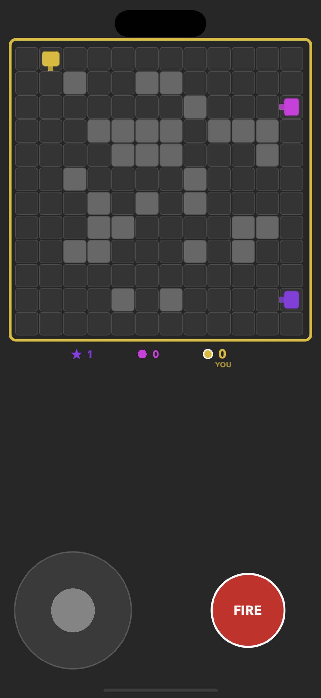

# Tank Battle

A multiplayer tank game using Bluetooth/WiFi peer-to-peer connectivity.

## Features

- **Multiplayer**: Unlimited* players over Bluetooth/Local Network using MultipeerConnectivity
- **Procedural Maps**: Seeded random map generation for consistent gameplay
- **Simple Controls**: Joystick to move, button to fire
- **Variable Map Sizes**: From 4x4 to 12x12 grids

*Theoretically

## Gameplay

Battle against friends in fast-paced tank combat! Navigate procedurally generated maps, dodge incoming fire, and be the last tank standing.

  
  

*Maps come in different sizes — from compact 6x6 arenas to sprawling 12x12 battlefields.*

## Architecture

The game uses a clean, modular architecture:

| File | Purpose |
|------|---------|
| `Tank.swift` | Tank entity (position, direction, movement) |
| `Projectile.swift` | Projectile entity with collision detection |
| `Map.swift` | Seeded procedural map generation |
| `Game.swift` | Game state management |
| `Network.swift` | MultipeerConnectivity wrapper |
| `Messages.swift` | Network message types |
| `GameScene.swift` | SpriteKit rendering and game loop |
| `GameViewController.swift` | Lobby UI and game presentation |

## A Poem

*Tanks roll across an 8-bit grid,*
*Shells fly where other players hid.*
*Bluetooth hums, peers connect and find,*
*One last tank standing — leave the rest behind.*

## Requirements

- iOS 18.0+
- Xcode 26+

## Building

Open `tankgame.xcodeproj` and build the `tankgame iOS` target.

